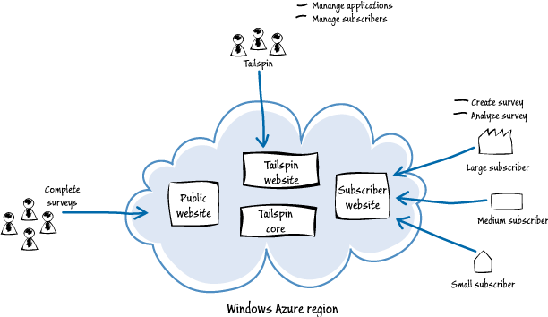

## 1.1 Tailspin公司

Tailspin是一个创业型独立软件开发商（ISV），它只有大概20个员工，专注于使用微软的技术开发解决方案。Tailspin的开发者熟悉许多的微软的产品和技术，包括.NET Framework，ASP.NET MVC，SQL Server，和Visual Studio，他们对Windows Azure有一些认知但是从未在该平台上开发过完整的应用。

Surveys应用一系列创新性的在线服务中第一个，Tailspin公司想要把它投入市场。作为一个创业公司，该公司想要以最小的硬件和IT人事投入，并且希望该在线服务将来可以快速增长，公司也有能力可以应对这种快速增长带来的需求，它也完全预计即使这些服务失败了，也不想在手边留下冗余的硬件资源。

### 1.1.1 Tailspin的策略

Tailspin是一个创新和灵活的组织，它已经准备好探索 一些关于云端的新技术和新业务机会。做为创业公司，Tailspin愿意冒险和使用新技术来实现应用，它计划拥抱云技术，并且作为早期的拥趸者可以获得竞争优势。另外，也希望可以快速的获得一些经验，然后立马开拓学习到东西。这种策略被称为“快速试错（try, fail fast, learn, and then try again）”。Tailspin已经决定以Surveys应用作为基于云服务业务的开始。

### 1.1.2 Surveys应用

Surveys应用提供Tailspin的客户一些服务，包括设计调查问卷、发布调查问卷以及收集它的分析结果。一个调查问卷是一些问题的集合，其中一个问题可以是好几种类型，比如是多项选择、数值范围、自定义文本。客户可以通过创建一个Surveys服务的一个订阅开始使用，由此来管理他们的调查问卷，并且可以应用他们自己的风格和Logo。
 
客户也可以选择他们账号的地理区域，这样他们可以尽可能的挨近所要调查的群体。除此之外，Tailspin给高级用户在调查问卷中定制化，可以与他们现成的系统很好的集成。Surveys应用允许用户免费的的试用，并提供用户注册来使用几种不同服务方案中一种，每种方案包含多种服务特性并以月付费的方式提供。  

下图说明了Surveys应用并说明和它交互的三组用户。和核心服务交互的三个站点组成了Surveys应用，并且提供了对该应用程序数据存储的访问。 

注册Surveys应用并成为订阅用户（或者正在试用）的客户接入自己的主页，这让他们可以设计自己的调查问卷，应用品牌和定制化，并且可以收集和分析问卷调查的结果。根据他们选择的服务方案，他们有接入Surveys应用不同功能级别的访问权限。Tailspin期望它的订阅用户（subscribers）来自世界各地不同的规模，并且他们可以为账户和问卷调查选择不同的地理区域。

*在软件即服务（SaaS）领域中，订阅用户一般被称为“租户（Tenant）”。我们通常指像Tails Surveys这样的应用称为“多租户（multi-tenant）”应用。当我们谈论Tailspin的“客户（customers）”时，我们是指订阅用户或者租户，我们在本书全篇使用这个术语。*

Tailspin想要以一种方式设计他们的服务，这种方式的大部分管理和配置任务都是自行完成的（self-service）且只需要Tailspin很少的介入，订阅用户即可完成。

公开的主页让参与问卷调查的人们可以完成问卷填写。问卷的创建者会以URL的方式通知他们的用户来访问完整的调查页。

Tailspin的主页自己的员工管理应用和订阅用户的账户。注意到这个主页你将会看到不包含在本书的例子应用中，只是专注于公共主页和订阅用户主页功能。

*关于为Tailspin Surveys应用打造Windows Phone 7客户端应用的信息，请查看《Developing an Advanced Windows Phone 7.5 App that Connects to the Cloud》。*

### 1.1.3 Tailspin的目标和关注点

Tailspin面临几个挑战，尤其是作为一个组织以及Suveys应用两者。首先，订阅用户也许想要创建与产品发布或者市场竞争关联的调查问卷，或者季节性的调查问卷——也许是某个假期的时间。通常，使用Surveys应用的订阅用户会给这个调查问卷设置一个非常短的截止有效期。

