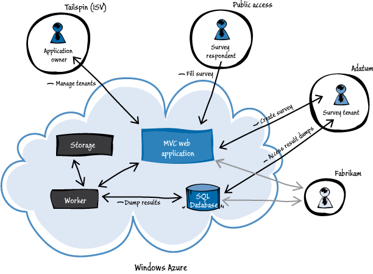
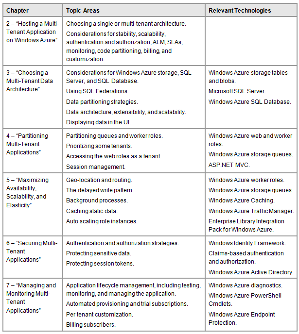

## 1.2 Surveys应用架构

为了达到Surveys应用的目标，Tailspin决定使用基于云的Windows Azure来实现该应用。下图展示了应用架构的高层视图。

Surveys应用的架构是很直观的，许多其他的Windows Azure应用也是使用此种架构。该应用的核心使用了Windows Azure Web角色，辅助角色和存储服务。上图展示了接入该应用的三组用户：应用拥有者、公众用户和Surveys应用的订阅用户（在这个例子中，是租户Adatum和Fabrikam）。它也突出了这个应用是如何使用Windows Azure SQL Database服务来提供一个机制给它的订阅用户存储调查问卷结果到关系型数据库中，由此他们可以详细分析这些结果。

本书讨论了Tailspin如何设计和实现多租户的Surveys应用。它遇到了常见的多租户应用挑战比如分区、扩展性、服务开通、可测试性和定制性。例如，本书描述了Tailspin如何处理订阅用户自己安全基础和应用认证的机制，这是通过使用一种“多重伙伴联合鉴别”的模型机制实现的。 本书讲述了使用混合数据模型决策的缘由，该模型是由Windows Azure存储服务和Windows Azure SQL Database服务组成。

本书的其他的主题讲述内容包括该应用如何使用Windows Azure Caching服务来保证问卷调查对象使用公众站点的响应能力，该应用如何自动化客户入门和服务开通过程，如何利用Windows Azure的地理分布特性以及订阅用户付费模型，该模型也被Tailspin在Surveys应用中采用。

Tailspin会使用Visual Studio，ASP.NET MVC，和.NET Framework来打造应用，下面这个表会帮助你识别本书的一些领域，他们与应用的许多特性和应用使用的Windows Azure服务一致。

