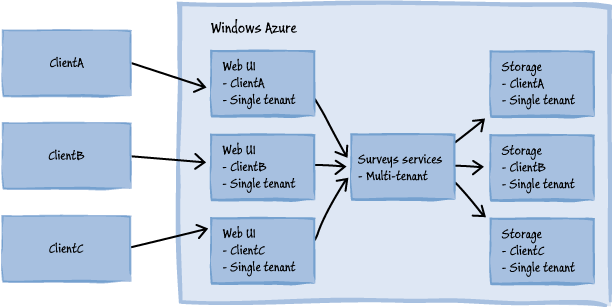

## 2.3 Windows Azure的多租户架构

在Window Azure中，多租户模型和单租户模型的区别并非上上图所示那么直观，因为Windows Azure中的应用能组成不同的元素，其中每个都能成为单租户或者多租户。例如，如果一个应用有一个用户界面（UI）元素，服务元素和存储元素，一个可能的设计可能如下图所示。

这并不是唯一的可能设计方案，但是它说明你不得不同样在你的应用中，为每个元素做出要么单租户要么多租户模式的选择。实践中，Windows Azure应用由更多的元素组成，如果上图所示，他们是队列、缓存或者虚拟网络，这些也许只是单租户或者多租户架构。

*在第三章“选择多租户数据架构”中，关注和数据存储和多租户相关的问题。在第四章“多租户应用分区”中，关注Windows Azure角色、缓存和队列相关的问题。在第六章“多租户应用安全”和第七章“管理和监控多租户应用”中覆盖了其他应用元素的多租户问题。*

你应该把你的应用设计为单租户还是多租户？这并没有对或者错的答案，但是，在接下来的章节中，会有许多的因素影响你的选择。