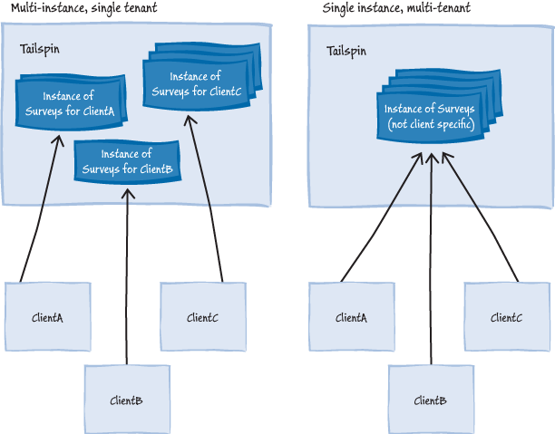
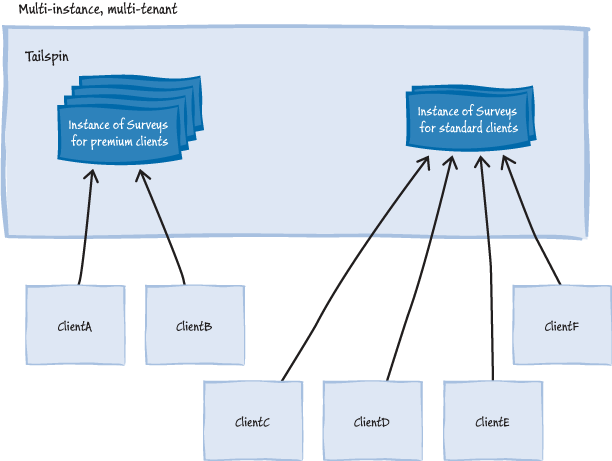

## 2.4 选择单租户或者多租户架构

本节介绍了一个架构师在决定一个单租户或者多租户设计时会考虑的一些准则，本节更仔细的重新思考这些主题，并在后面章节中引用Tailspin和Surveys应用。不同准则的相对重要性在不同的应用场景中变化很大。本章关注应用的架构、管理、和财务考虑。第三章“选择多租户数据架构”探索了更多的主题，他们是你在做一个合适的多租户数据架构是必须考虑的。

### 2.4.1 架构考虑

你应用的架构要求会影响你做单租户还是多租户架构的决定。

本节的重点是使用Windows Azure的云服务打造多租户应用：Web角色和辅助角色。然后在本章中安排的架构考虑，以及接下来的章节讨论的Tailspin实现Surveys应用时遇到的许多设计决策，同样的与你的多租户应用托管决策相关。例如，如果你决定使用Windows Azure Web网站服务打造多租户应用，或者使用Windows Azure虚拟机来部署它，你会面临和Tailspin许多相同的开发挑战，是它在使用Window Azure云服务开发在打造Surveys应用遇到的。

详细讨论Windows Azure虚拟机提供的“基础设施即服务（IaaS: Infrastructure as a Service）”方案，你应该阅读《云端应用迁移指南》中的第二章“云技术使用准备”，和第三章”迁移至Windows Azure云服务“，它讨论了使用Window Azure Web网站服务来在云端托管你的应用。

#### 应用稳定性

多租户的应用比单租户应用更容易出现实例故障。如果一个单租户应用的实例出现故障，只有唯一的实例用户受到影响。如果多租户实例故障，所有用户都会波及。然而Windows Azure可以通过部署多重同样的Window Azure角色实例来减低风险，这些角色实例组成你的应用（这是真正的多租户多实例模型）。

Windows Azure的负载均衡在多个实例间执行请求，当你部署多个实例时，你必须设计你的应用来正常的运行。例如，如果你的应用使用会话状态，你必须保证每个Web角色实例的任何用户可以访问这些状态。除此之外，当Windows Azure可以选择任何一个辅助角色执行一些特殊的任务时，这些辅助角色必须正确的执行任务。Window Azure监控你的角色实例摈弃出现失效时自动重启。

*对于Windows Azure SLA在你应用中使用时，你必须至少有每种角色实例类型的两个实例在运行。更多的信息查看“服务等级协议（SLA: Service Level Agreements）”*

Windows Azure可以限流资源的访问，使他们暂时的不可用。特别是当资源的高度争用时发生。你的Window Azure应用应该在其被限流时检测到，并且采取适当的措施如一段延时后重试操作。

*瞬时故障处理应用程序块（The Transient Fault Handling Application Block）,作为Windows Azure企业库5.0集成包的一个单独安装部分，能以标准和可配置的方式处理因限流引起的瞬时故障。*

#### 应用可伸缩

运行在Windows Azure上的应用伸缩性很大程度上依赖于你能部署的多个Web角色和辅助角色实例，当能通过这些角色实例访问同样的数据时。Windows Azure上的单租户和多租户应用都使用这个特性来水平扩展应用。Window Azure同样也提供不同实例的性能让你可以垂直扩展或缩小单独的实例。

下图展示了你可以通过运行许多的实例来水平伸缩应用。在Windows Azure云服务中，这些会是多个Web角色和辅助角色实例。

*在Windows Azure中，适配应用来管理变化很大的负载的更好方式是通过增加额外的节点来水平扩展，而不是使用更大性能的节点来垂直扩展。这样可以让你在需要时扩容或者缩容而不用中断服务。你可以根据一个调度表使用框架或者脚本自动增加或者删除节点，或者响应需求改变来调整节点。自动伸缩应用程序块（The Autoscaling Application Block）作为Windows Azure企业库5.0集成包的一部分可以这样一种框架例子来使用。*

对于一些应用，你可能不想让你所有的订阅用户共享一个多租户实例，例如，你可能想根据他们使用的功能或者期待的使用模式把他们分组，然后优化订阅用户正在使用每个实例。在这种情况下，你可能需要多个拷贝实例的多租户应用，他们部署在不同的云服务或Windows Azure账户中。

下图说明了高级订阅用户共享一个应用实例的场景，标准订阅用户共享另一个实例。注意到你可以独立的缩放每个实例。

*尽管上图展示的模型可以让高级订阅独立于独立于标准订阅用户来简单的扩容应用，但这并不是唯一操作不同订阅级别的方式。例如，如果高级和标准订阅用户共享同一个实例，你可以实现一个算法来给高级用户优先使用权。保证他们的工作负载和任务在实例上有更高的优先级。通过提供配置参数，你能够动态地调整算法。*

当你的应用有许多租户时，如果你使用动态伸缩方案，你需要考虑任何你应用伸缩性方面的限制，因为每一个运行的角色实例会产生费用，可能会出现一个租户的活动引起许多的实例自动启动。对于固定的费用收费标准，这会引起服务供应商比较高的成本。根据使用量付费标准，这对租户产生很高的费用。

你可能想要考虑使用Windows Azure Caching服务和Windows Azure Traffic Manager服务来增强应用的伸缩性。除了提供输出缓存和数据缓存外，Windows Azure Caching服务包括高度可伸缩的会话提供器用在ASP.NET应用中。raffic Manager服务让你控制流量的分发到多个Windows Azure部署实例中，即使这些部署实例在不同的数据中心中。

第四章“多租户应用分区”保护关于如何使用Windows Azure Caching服务更多的信息，第五章“最优化可用性、可伸缩性和灵活性”讨论了伸缩性及其相关的主题，包括Windows Azure Traffic Manager服务和使用企业库自动化伸缩程序块（Enterprise Library Autoscaling Application Block）如何自动化地伸缩你的应用。

#### 资源限制和流量控制

你应用架构的个人元素会有特殊限制，如消息队列元素（Windows Azure storage队列或者Windows Azure服务总线）的最大吞吐量，或者在你系统中每秒被数据存储系统支持的最大事务数量。这些资源限制可能对使用特定实例的租户数量有制约。你必须理解这些限制和限额参数，他们与可能的租户使用模式相关，这样可以不影响应用整体的性能。

*一些和Windows Azure服务总线相关的限额参数包括队列/主题（queue/topic）大小，并发连接数量，和每个服务命名空间的队列/主题数量。*

更进一步，许多云端的资源，消息队列和存储系统，在他们高负载和高峰活动时，可能会限流使用一段时间。你应该尽量设计你的应用防止被限流，即使被限流也要保持弹性。

#### 地理分布

如果你的应用有来自多个地理位置的租户，让他们在本国或本区域访问资源可以帮助提高性能和减少延迟。在这种场景中，你应该考虑使用一种分区模式，它使用了与租户特殊资源相关的地理位置。在Windows Azure中，无论你创建了一个资源如存储账号、一个云服务、或者一个服务命名空间，你都可以指定资源将被托管的地理位置。

#### 服务等级协议(SLA)

你可能想要给不同的服务订阅级别提供不同的服务等级协议（SLA）。如果有不同SLA的订阅用户正共享同一个多租户实例，你应该树立达到最高的SLA的目标，由此保证你能满足其他低SLA的订阅用户。

然而，如果你有不同SLA的限制数量，你可以吧所有共享同一个SLA的订阅用户安置在同一个多租户实例中兵保证这个实例有充足的资源满足SLA的要求。

#### 法律和监管环境

对于一些应用，你可能需要考虑特定监管和法律问题。这可能需要功能性上有些不同，特别是在界面上显示的法律信息，或者数据存储在特定的国家或者区域。这也可能导致导致为分组的订阅用户分离多租户部署，或者甚至可能需要一个单租户架构。

#### 处理认证和授权

你可能需要云端应用提供你自己的认证和授权系统，这需要订阅用户设置将会和应用交互的用户账号。然而，订阅用户更倾向于使用他们已经建立的存在认证系统（比如微软或者谷歌账号，或者一个他们自己的活动目录中的账号），且可以避免不得不为应用创建一个套新的凭证系统。

在一个多租户应用中，这个暗示要能支持多种认证服务提供商，也尽可能的需要一种定制的到你应用授权方案的映射。例如，一个在Adatum租户的活动目录中的一个管理者（Manager），也许被映射为Adatum的Tailspin Surveys应用中一个管理员（Administrator）。

第六章“多租户应用安全”详细的讨论了多租户应用认证和授权的主题。

*想要获得更多云端应用身份、认证和授权信息，请查看“A Guide to Claims-Based Identity and Access Control”指导书。你可以下载这个版本的PDF拷贝。*

#### 命令查询职责分离模(CQRS: Command Query Responsibility Segregation)模式

CQRS模式是一种架构设计模式，它可以让你面对广泛的架构挑战，比如管理复杂性，管理变化的业务规则，或者在你系统的某个部分达到扩展性。注意到CQRS模式并非顶层模式非常重要，并且应该只能在一些可以清晰可辨的收益特殊系统领域中应用。

许多本章中列出的和架构挑战相关的多租户考虑事宜，CQRS能帮助你找到。然而，你不应该假设多租户必须暗示你应该使用CQRS模式。例如，尽管Tailspin Surveys应用必须高度可伸缩来支持许多不同使用模式的订阅用户，它并不是一个特别复杂的应用。特殊地，它并不是一个需要许多用户同事使用和编辑相同数据的协作软件，这正是使用CQRS模式考虑的一个场景。此外，Tailspin并不期望在Surveys应用中的它的商业规则随时间变化太多。

更多关于CQRS模式的信息，并且当你考虑使用它的时候，请查看指导书“A CQRS Journey”。

### 2.4.2 应用生命周期管理的考虑

你单租户或者多租户的架构决策将会决定你开发、部署、维护和监控应用的难以程度。

#### 维护代码库（code base）

为每个不同的订阅用户维护独立的代码库会导致独立软件开发商（ISV）逐步增加支持和维护的费用，因为追踪那个订阅使用哪个版本越来越难。这会导致犯下成本高昂的错误。一个单一逻辑实例的多租户系统保证了一个单独的应用代码库。如果你的多租户软件使用了一些单租户元素，可能有短期的诱惑（带来长远的后果）来为独立的订阅用户分支这些元素的代码，这样来满足他们一些订阅用户独特的需求。

在一些场景中，会有高度定制化的需求，多样的代码库可能是一个可行的选择，但是在实践之前你应该探索你能做到自定义配置或自定义业务组件的程度。如果你需要多个代码库，你应该组织你的应用以致于自定义代码尽可能的限制组件数量。

#### 处理软件升级

一个有单一代码库的多租户应用可以容易地在同一时间开展对所有订阅用户的软件的升级。这个方法意味着你只有一个逻辑实例要升级，降低了维护工作。除此之外，你知道你所有的订阅用户都在使用最新的软件版本，这使你的支持工作更加容易。Windows Azure升级域通过跨多个角色实例开展升级来促进这个过程，且不用停止软件服务。然后，你必须小心的计划你如何进行软件的在线升级，考虑到这个事实，就是在升级期间会有短暂的不同软件版本实例在同时运行。

如果一个客户端有操作的程序或者软件绑定你应用的一个特殊版本，任何升级都需要和它协调。为了减少升级带来的风险，你可以实现一个准更新程序（rolling update program）来升级一些用户的应用，监控这个新的版本，并且当你对新的版本有信心时，把改变的应用更新派发给剩余的用户。

*获取更多关于如何升级Windows Azure服务和可供的不同方案的信息，请查看“Overview of Updating a Windows Azure Service”。*

#### 监控软件

监控单一的软件实例比监控多个实例更简单。在多实例、单租户模型中，任何的自动化服务开通需要包含设置新实例的监控环境，这会增加你应用服务开通过程的复杂性。如果你决定使用准更新，你的监控也会变得更复杂，因为你必须同时监控多个版本的应用并且使用监控数据评估新版本的应用。

第七章“管理和监控多租户应用”包含更多信息，他们是关于多租户应用中实现高效管理和监控的实践。    

#### 使用第三方组件

如果你决定使用多租户架构，你必须仔细的评估第三方组件如何更好的运转。你可能需要更多的工作来保证第三方组件有“多租户意识”。在单租户、多实例的部署中，你想要能水平伸缩租户，你也需要验证第三方组件保证“多实例意识”的。

#### 试用和新订阅用户服务开通

如果服务开通只涉及到配置文件的变更，那么为新客户开通服务或者初始化一个免费试用服务会更简单和快捷。一个多实例、单租户的模型将需要你为每一个订阅用户部署一个应用的新实例，包括免费试用版本。尽快你可以自动化这个过程，比起在单实例、多租户应用中改变和创建配置文件数据，它依然相当地复杂。

第七章“管理和监控多租户应用”包含了在多租户应用中为新订阅用户开通服务的更多信息。

### 2.4.3 定制应用

不论是否选择单租户还是多租户架构，订阅用户仍然需要能够定制应用。

#### 由租户定制化的应用

订阅用户想要面对他们的客户时能够设计自己的风格和打上自己的商标。你必须建立订阅用户想要的控制程度来决定启用最优化定制。从有能力定制应用的外观，如允许订阅用户上传CSS和图片文件，到让订阅用户能够基于标准的API设计完整的页面来和应用服务交互，这可能变化很大。

你可以通过租户可以改变的配置值来实现简单的定制化，应用存储器可以存储这些值，比如自定义的Logo图片，欢迎文字，或者切换到特殊的功能。例如，在Surveys应用中，订阅用户可以选择是否把他们自己的基础设施和应用的基础设施集成，他们能根据调查问卷选择地理位置。这种配置数据能够容易的存储在Windows Azure Storage中。

其他的应用可能需要一种让用户在应用的某种程度上定制业务过程的能力。这里可行的选项包含实现一种插件架构，这样可以让订阅用户上传他们自己的代码，或者使用某种形式的规则引擎通过配置来启动过程定制。为了实现插件架构，你可以考虑在你应用加入PowerShell运行时（查看MSDN的System.Management.Automation命名空间），或者使用Managed Extensibility Framework (MEF)。

其他的替代方案可以考虑让你的应用调用有租户提供的端点服务，它执行某种逻辑然后返回一个结果。

你可能也想提供给租户多种方式扩展应用而不使用自定义代码。Surveys应用的订阅用户可能想要获得额外的关于调查问卷填写者的信息，这是标准应用中不具备的。为了实现这个特性，你必须实现一种定制UI来收集数据的机制，和一种扩展数据存储模式的方式来包含新数据。

第七章 “管理和监控多租户应用”包含更多为多个租户关于定制化应用的信息，并且建立一种高效的客户入门机制。

#### URL访问应用

你可以在多租户应用中采取几种不同的URL方案来让租户访问他们的数据。下面描述了Tailspin Surveys应用场景中一些可行的选项，订阅用户能在这些场景下发布问卷调查，公众用户不需要登陆来访问这些问卷调查：

* **“http://surveys.tailspin.com/{唯一的问卷调查名}。** 所有的问卷调查都在同一域名下，订阅用户必须为每一个问卷调查选择一个唯一名字。
http://surveys.tailspin.com/{subscriber-name}/{survey-name}. Again all surveys are made available on the same domain, but subscribers now only need to ensure that their own survey names are unique.
* **“http://surveys.tailspin.com/{订阅用户名}/{问卷调查名}。** 再次，所有的问卷调查都在同一域名下，但是订阅用户选择仅需保证他们自己的问卷调查名唯一就可以了。
* **“http://{订阅用户子域名}.tailspinsurveys.com/{问卷调查名}。** 每个订阅用户被分配了他们自己唯一的子域名，订阅用户只需保证他们自己的问卷调查名唯一就可以了。
* **http://{subscriber-domain-name}/{survey-name}。** 每个订阅用户都由自己的域名，并且订阅用户只需保证他们自己的问卷调查名唯一就可以了。

*订阅用户可能会倾向选择他们公司名出现在URL中的一个，这个URL可以被公众访问到。*

下面描述了一些Tailspin Surveys应用场景中可能的URL方案，这些场景中订阅用户能够设计和管理他们自己的问卷调查，订阅用户必须登录如下选项：

* **https://surveyadmin.tailspin.com/。** 当订阅用户登录后，他们可以设计和管理他们的问卷调查。
* **https://surveyadmin.tailspin.com/{订阅用户名}。** 订阅用户也必须登录来设计和管理他们的问卷调查。
* **http://{订阅用户域名}.tailspinsurveys.com/admin。** 每个订阅用户被分离他们自己唯一的子域名，并且“admin”路径需要订阅用户登录。
* **https://{subscriber-domain-name}/。** 每个订阅用户有他自己的域名来做操作管理功能，并且订阅用户也必须登录。

在这种情况中，第一个选项可能会好接受。在URL任何位置中包含订阅用户的名字没有什么重大的益处。

在两种场景中，也考虑到了订阅用户的喜好，你也需要考虑URL方案的选择可能如何影响应用的其他部分，比如服务开通过程和正在使用的认证机制。定制的域名需要DNS花费一定的时间来扩散（译者注：域名设置好后需要一定的时间在各个域名服务器之间传送保存后才能生效）。除此之外，如果你支持多种认证方案，订阅用户的名字也不出现在URL中，你必须考虑订阅用户如何选择正确的认证机制。如果你需要使用SSL，你也需要考虑如何安装必要的证书。

第四章“多租户应用分区”讨论Tailspin在Surveys应用中采用的URL方案并运行在两个Web角色中。
                                                                                                                       
### 2.4.4 财务考虑

你的收费和花销模式可能会影响你单租户和多租户架构的选择。

#### 向订阅用户收费

对于部署在Windows Azure中的应用，微软会向你每月索取服务（计算、数据、事务等等）费用，他们在你每个Windows Azure账号中使用。如果你向订阅用户出售一种服务，如同Tailspin Surveys应用一样，那么你为这些服务向他们计费。

#### 按用量计费方式

一个收费方案是使用按用量计费方式。此种方式中，你监控每个订阅用户的资源使用情况，计算这些资源的花费，并且计划一个收费模式来保证可以盈利。如果你使用一个单租户架构且为你的每一个订阅用户创建了一个单独的Windows Azure账号，这很容易确定一个独立订阅用户花费，可以根据计算服务、存储服务使用情况等等，然后向订阅用户合理的收取费用。

然而，对于独立的Windows Azure账号中运行的单租户实例，一些花费实际会比较固定，比如，对于小型的订阅用户来说，24x7小时的计算实例或者Windows Azure SQL Database实例可能起步费用比较高。对于多租户架构，你可以分享在多个租户共享这种固定费用，但是计算每个租户的花费并不直观且你将不得不在应用中添加额外代码来衡量每个租户的使用情况。更进一步，订阅用户会想要一种方式来跟踪他们的花费情况，因此你将不得不把关于花费如何计算和提供访问这些捕获的使用量数据。

#### 按每月固定计费方式

第二种方案就是采用一种每月固定的问卷调查服务收费方式。要预估一个独立的订阅用户会使用多少服务是非常困难的，对于Surveys应用来说，Tailspin不能预估在一段时间内订阅用户会创建多少问卷调查或者会收到多少问卷调查答案。因此，在订阅用户中间的盈利可能变化很大（有时候可能甚至亏损）。

通过使Surveys应用成为多租户形式，Tailspin能够平滑的消除订阅用户之间使用模式带来的差别，更容易预估总的花费和收益，降低亏损的风险。越多的订阅用户，意味着更容易预估服务的平均使用模式。
