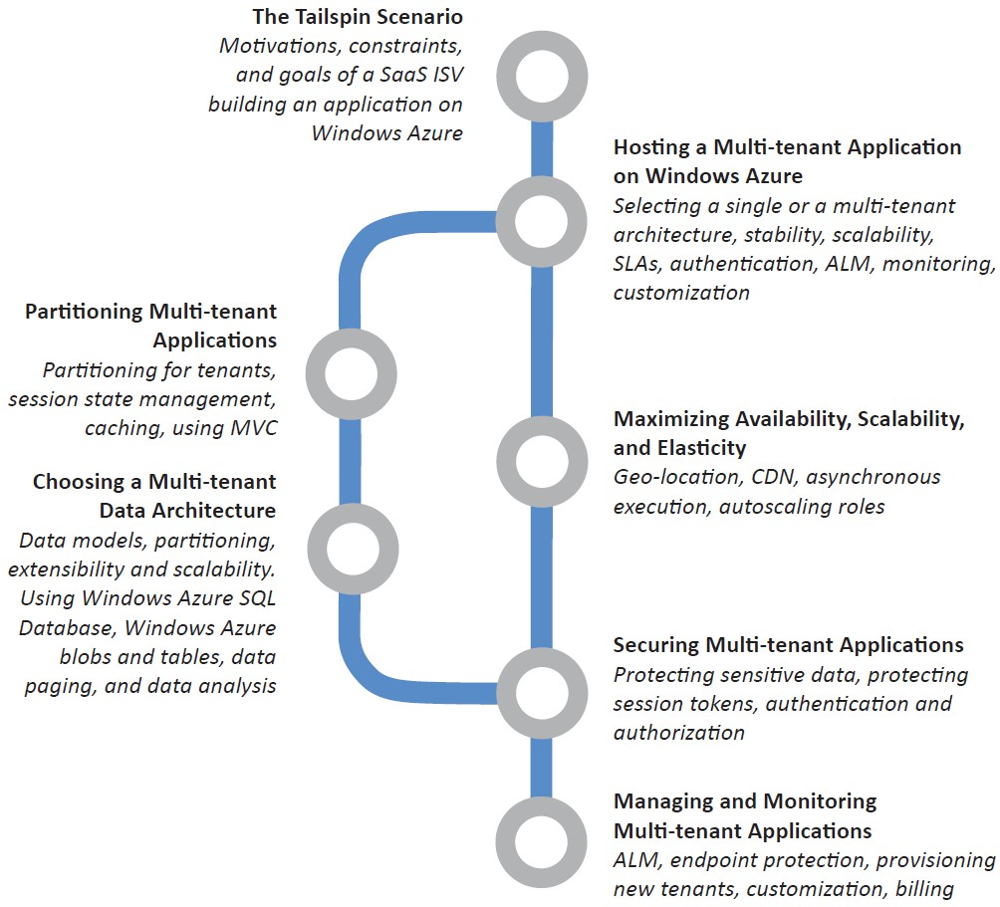
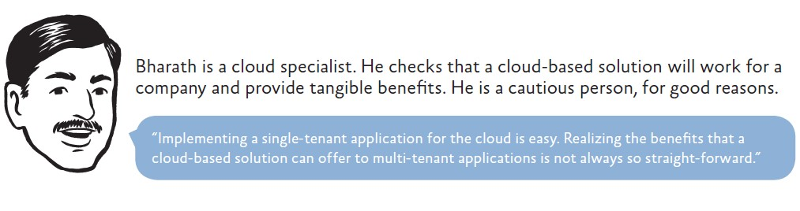
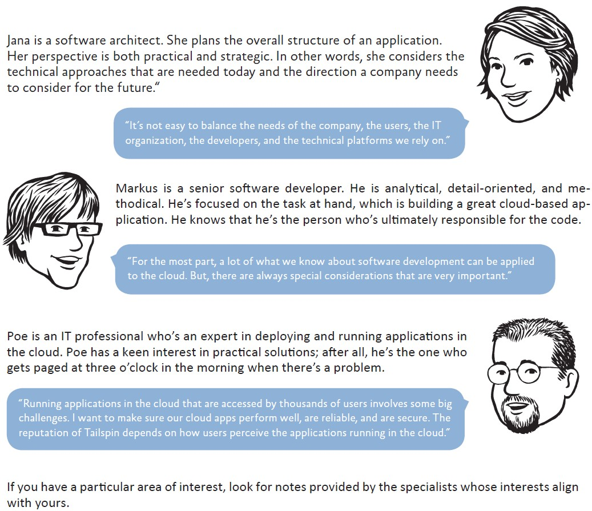

# 前言

一个企业怎么才能创建一个可以快速伸缩式的应用来满足突发的大量访问的需求？历史上，企业不得不投资在基础设施的建设来满足这种需求，诚然，只有大型的企业才有可用的资源来冒险尝试。建造和和管理他们并不便宜，特别是不得不为了应对峰值的访问而带来大部分时间里资源空置的浪费。云技术已经改变了这种模式。基础设施以”为量而付费“的方式，可以创建大型可伸缩式的全球性应用来同时满足大小型企业。

云平台土提供给你按需使用的容量、良好的容错机制、分布式的计算、遍布全球的数据中心以及和其他平台集成的能力。有其他人负责管理和维护整个基础设施的正常运行，而你只需要为你使用的资源付费。你可以专注于使用你核心领域的技能来打造和部署应用到靠近你用户的的数据中心中，然后监控他们并在需要的时候可以扩容和缩减。

当然，部署你的应用到云端意味着你要放弃一些控制和自主权，然而你将会从降低成本、增加灵活性和可伸缩性的计算和存储中获益。本书向您展示是如何做到的。

## 谁适合本书

本书是关于Windows Azure系列书籍的第二卷，卷一是《Windows Azure应用迁移指南》，它讨论托管选项，费用模型和云端应用生命周期管理；另外也描述了现存的ASP.NET应用迁移到云端的几种场景。本书展示了使用Windows Azure最新的工具和特性来创建一个多租户的PaaS应用。

本书适合架构师、开发者、IT专业人士，他们想要设计、建设、或者维护部署在云端交互的应用和服务。尽管应用不需要基于微软Windows操作系统和.NET语言来使用Window Azure，本书还是写给工作于Windows系统相关的人员。他们应该熟悉Microsoft .NET Framework，Microsoft Visual Studio开发环境，ASP.NET MVC模式，和Microsoft Visual C#编程语言。

## 为什么本书是相关的

总的来说，云技术已经成为了可行的选择来让你的应用可以被广泛的用户接入。正好，Windows Azure有一套完整的工具供开发者和IT专业人士使用。开发者可以用他们熟悉的技术来开发云端应用，比如Visual Studio，除此之外，Windows Azure也包含了云端存储模拟器和计算模拟器，在部署应用在云端之前，可以供开发者本地编写、测试和调试他们的应用。另外也提供一些工具和API来管理你的Windows Azure账户。本书向您展示了在一些常见的场景中，你该如何使用这些工具，最后如何在Windows Azure中开发全新的、多租户的SaaS应用。

## 本书如何组织

以下管状图向您展示了本书是如何组织的

“Tailspin场景”章向您介绍了Tailspin公司和他们的Surveys应用。并提供了该应用的架构概览，接下来的章节提供了更多的关于Tailspin如何设计和实现云端的Surveys应用。阅读这章会帮助你理解该公司的业务模型，采用云平台的一些策略。它也会帮助你理解该公司在设计应用时不得不做的基本决择。

“在Windows Azure上托管应用”章讨论在Windows Azure上架构和开发多租户应用的一些主要的问题。它描述了你必须考虑的问题——多租户架构的优点和和相应的权衡。例子里提供了概念性的框架来帮助你理解在接下来的更多章节中讨论的主题。

“选择多租户的数据架构”章描述了在设计多租户应用的数据模型时需要考虑的重要因素。他们是你如何对数据分区、为可扩展性和可伸缩性做计划、如何使用Windows Azure的存储服务和关系数据库来做应用设计。例子里描述了Surveys应用s是如何同时使用Windows Azure Tables服务和Blobs服务来存储数据的，并且Tailspin的开发者是如何设计他们的存储类来满足扩展性和测试性的。另外也描述了Windows Azure SQL Database在在该应用中所起的作用。

“多租户应用隔离”章描述了如何隔离多租户应用的代码。这包括如何使用Web云服务和工作角色、队列和MVC模式来开发最有效的多租户应用。例子里讨论主题主要围绕了缓存、Tailspin如何解决一些特定的问题，他们是关于会话状态实现的。

“最优化可用性、可伸缩性和灵活性”章描述了你可以使用的一些技术，他们主要用来获取应用最优的性能和响应，特别是当你用这些技术来支持多租户应用。例子涵盖了一些话题，包括部署多地理位置的应用、使用内容分发网络（CDN）来缓存数据、使用队列服务来做读写模式、分片和展示数据和自动化伸缩角色实例。

“多租户应用安全性”章描述了在支持独立的订阅和用户和他们建立信任关系时的认证和授权场景。例子里详述了Tailspin公司用敏感数据实现的保护和隔离，以及如何保护会话令牌。

“多租户应用监控和管理”章节详述了关于多租户应用需要考虑的应用生命周期管理（ALM - application lifecycle management），例子里描述了Tailspin公司如何管理和监控他们的应用，以及应用本身如何支持客户入门、定制化和付费模式。

## 使用代码

运行场景代码时你需要如下系统要求

* Microsoft Windows 7 with Service Pack 1, Microsoft Windows 8, Microsoft Windows Server 2008 R2 with Service Pack 1, or Microsoft Windows Server 2012 (32位或者64位版本)

* Microsoft .NET Framework 4.0

* Microsoft Visual Studio 2010 Ultimate, Premium, or Professional edition with Service Pack 1，或者Visual Studio 2012 Ultimate, Premium, or Professional

* Windows Azure SDK (包括由Visual Studio提供Windows Azure相关工具)。查看每个版本的发布信息

* Microsoft SQL Server 2012, SQL Server Express 2012, SQL Server 2008, or SQL Server Express 2008。根据你的系统需求和软件版本信息匹配安装

* ASP.NET MVC 4 Framework

* Windows Identity Foundation。当用做基本的授权时需要

* WebAii testing framework。 只有当需要功能测试时需要。请将Lib\WebAii下的库文件ArtOfTest.WebAii.dll放入例子程序中

当你运行项目解决方案时，需要的其他组件和框架可以通过NuGet来获得，请查看安装和配置的例子说明信息。

## 更多信息

本书列出了许多的相关资源信息。他们可以帮助你获得额外的背景知识，使你加快技术上的速度等等。为了方便，有在线参考资源，他们包含了许多你可以点击访问的链接。

## 评论

下面是一些专家关于本书Tailspin开发成果和Surveys例子应用的评论。他们包括云技术专家、软件架构师、开发者、IT专业人士。Surveys应用要表述的东西可以从这些评论中有所感悟。以下列出了这些专家评论意见。

